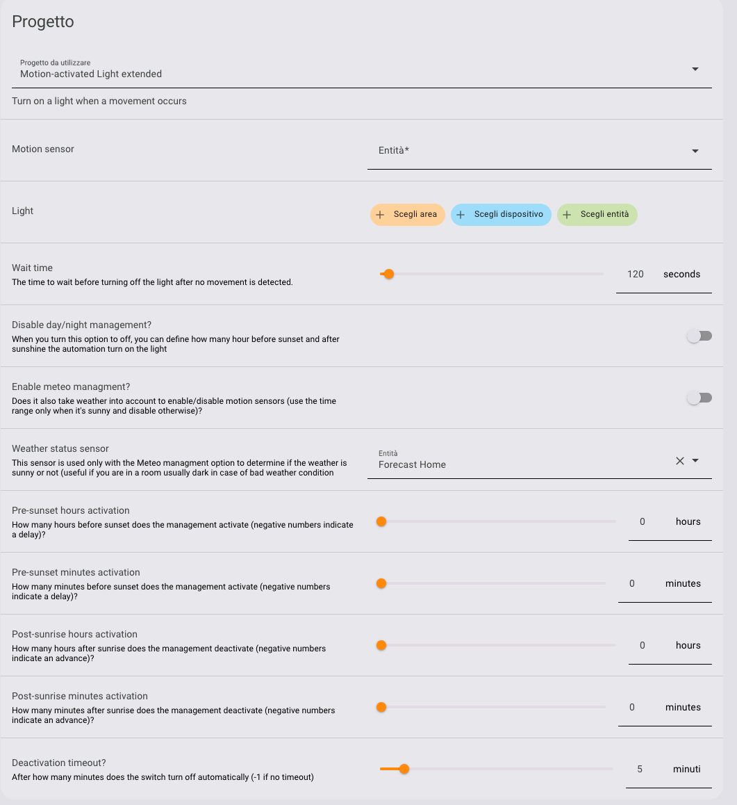

# MOTION ACTIVATE LIGHT EXTENTED

This is blueprint for Home Assistant intended to help to create automations to turn on/off lights as a reaction of a movement sensor.
*This is an evolution of standard motion activated light.* 

In this blueprint, I've supported some important additional features intended to improve the flexibility of the component.

* **Ability to activate enable/disable the motion activation light based on sunset and sunlight**

* **Ability to override the sunset / sunrise conditional activation based on the weather**

* **Ability to define a timeout** after that the light turn off also if movement sensor is already on (useful to situations in which sensors sometimes fails to communicate deactivation due to connectivity problems).

All this options can be activated or not so you can freely combine them. For use the blueprint in its more general form you need one or more entities of this domains/class:

* binary_sensor / motion
* light
* weather

